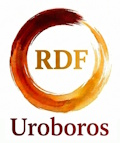

 
# Uroboros-RDF

**Recursive Discovery Framework v3** — an autonomous research orchestrator that leverages a multi-tiered hierarchy of AI agents to automate scientific discovery, code generation, and empirical analysis.

Uroboros-RDF pairs strategic planning with autonomous execution in a closed-loop system, now featuring **recursive sub-goal decomposition**.

## Key Features

- **Recursive Orchestration:** The **Planner (Gemini 2.5 Pro)** can autonomously decompose complex research goals into sub-goals and delegate them to specialized sub-agents.
- **Dual-Agent Synergy:** Combines the high-level reasoning of Gemini with the specialized coding capabilities of **Claude Code** or the cost-effective performance of **Qwen 3.6**.
- **Model Hierarchy & Efficiency:**
    - `low`: **Qwen 3.6 35B-A3B** (via OpenRouter) — fast, efficient, and extremely cheap for routine tasks.
    - `medium`: **Claude 3.5 Sonnet** — the default for complex implementations.
    - `high`: **Claude 3 Opus** — for foundational architectural reasoning.
- **Session Persistence:** Full recovery after token limits or quota hits. The framework preserves agent history, allowing seamless retries without losing context.
- **Scientific Methodology:** Rooted in the "Minimal Validating Step" principle, ensuring every iteration tests a falsifiable hypothesis.
- **Persistent Environment:** Agents operate within a persistent `src/` directory, evolving the codebase iteratively across the entire research lifecycle.

---

## How it works

```
┌─────────────────────────────────────────────────────────────┐
│  PLANNER (Top-level)  Gemini 2.5 Pro / Qwen 3.6             │
│  · analyses state + research log                            │
│  · identifies sub-goals and chooses agent tiers             │
└──────────────────────┬──────────────────────────────────────┘
                       │ run_agent(complexity='...')
        ┌──────────────┴──────────────┬──────────────┐
        ▼                             ▼              ▼
┌─────────────────┐           ┌────────────────┐    ┌─────────────────┐
│ EXECUTOR (low)  │           │ EXECUTOR (med) │    │ SUB-PLANNER     │
│ Qwen 3.6 MoE    │           │ Claude Sonnet  │    │ Gemini 2.5 Pro  │
│ · simple scripts│           │ · refactorings │    │ · decomposes    │
│ · data parsing  │           │ · debugging    │    │ · nested loop   │
└────────┬────────┘           └───────┬────────┘    └────────┬────────┘
         └──────────────┬─────────────┴──────────────────────┘
                        │ result.yaml
┌───────────────────────▼─────────────────────────────────────┐
│  COMMIT  git commit + optional push                         │
│  · hypothesis → git commit message                          │
│  · milestone_reached → git tag milestone-<name>             │
└─────────────────────────────────────────────────────────────┘
```

---

## User Interface

The interactive startup menu and post-iteration controls provide precise steering:

| Key | Action |
|-----|--------|
| `y` | Start/Continue next iteration. |
| `r` | **Retry** last iteration (uses same ID, perfect after bug fixes). |
| `h` | Set/Edit a **Hint** for the planner (displayed as ACTIVE HINT). |
| `a` | **Autonomous mode** — runs until milestone, error, or loop detected. |
| `o1-oN`| Focus the planner on a specific research direction from its own list. |
| `s` | Show current status (git log). |
| `n` | Stop and save session. |

---

## Setup

**Requirements:** Python 3.11+, Gemini API key, OpenRouter API key (optional), Claude Code CLI.

```bash
# 1. Clone and create the tool venv
git clone https://github.com/schmiereck/uroboros-rdf
cd uroboros-rdf
python -m venv .venv
.venv\Scripts\activate          # Windows
pip install -r requirements.txt

# 2. Set API keys
set GEMINI_API_KEY=...
set OPENROUTER_API_KEY=...      # For Qwen 3.6 support

# 3. Authenticate Claude Code
claude login
```

---

## Creating a research project

```bash
# Initialise a project directory
python rdf.py --project path\to\my_project init

# Run in Iterative Mode (standard)
python rdf.py --project path\to\my_project run

# Run in Project Mode (decomposition-focused)
python rdf.py --project path\to\my_project project
```

The system prompts are now modular and can be customized in `rdf/core/prompts/*.md`.

---

## Example research project

**Digital Physics / Bit-Grid Universe** — exploring whether physical phenomena like mass, gravity, and time dilation can emerge from minimal reversible rules on a discrete lattice.

→ [schmiereck/rdf_digital_physic](https://github.com/schmiereck/rdf_digital_physic)

---

## Configuration (`config.toml`)

```toml
[roles]
planner_model    = "gemini-2.5-pro"
planner_adapter  = "gemini"         # or "openrouter"
executor_adapter = "claude-code"

[agent_routing]
default_complexity = "medium"
max_depth = 4                       # Max recursion for sub-planners

[limits]
max_iterations = 100
max_state_tokens = 8000
executor_timeout_sec = 14400        # 4 h per run
```
